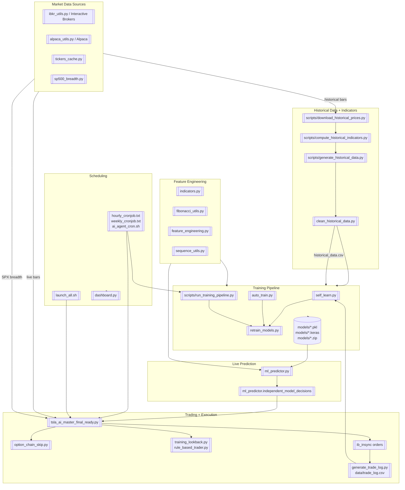

# AI Trading Agent Workflow Diagram

The diagram below shows how the repository's major scripts and modules interact to collect data, engineer features, train models, and run the live trading loop.

## Component Notes

- **Data acquisition:** `ibkr_utils.py` and `alpaca_utils.py` fetch live bars and account data, while `tickers_cache.py` caches watchlists and `sp500_breadth.py` tracks the S&P 500 percentage-above-20-day breadth signal.
- **Historical pipeline:** `scripts/download_historical_prices.py` downloads raw bars; `scripts/compute_historical_indicators.py` computes indicators for each ticker; `scripts/generate_historical_data.py` aggregates the per-ticker files; `clean_historical_data.py` validates and fixes gaps.
- **Feature engineering:** Core indicator math lives in `indicators.py` and `fibonacci_utils.py`. `feature_engineering.py` builds model-ready frames from live bars, while `sequence_utils.py` pads sequences for LSTM/Transformer inputs.
- **Model training:** `self_learn.py` labels trades and prepares `FEATURE_NAMES`; `auto_train.py`, `retrain_models.py`, and `scripts/run_training_pipeline.py` orchestrate training for Random Forest, XGBoost, LightGBM, LSTM, PPO, and Transformer models stored under `models/`.
- **Inference and trading:** `ml_predictor.predict_with_all_models` loads the trained artifacts and `independent_model_decisions` selects the highest-confidence signal. `tsla_ai_master_final_ready.py` executes trades, consults `option_chain_skip.py` for liquid options, applies risk checks (`training_lookback.py`, `rule_based_trader.py`), and logs fills via `generate_trade_log.py`.
- **Automation:** Cron definitions (`hourly_cronjob.txt`, `weekly_cronjob.txt`) and launcher scripts (`launch_all.sh`, `ai_agent_cron.sh`) run the agent on schedule; `dashboard.py` surfaces runtime stats.
